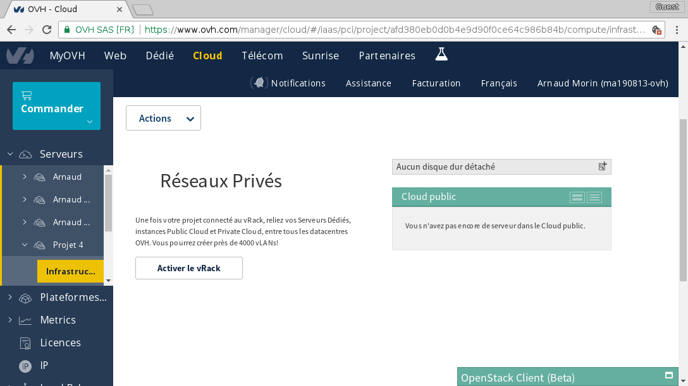

# Introduction
## Objective

Main objective is to create an small OpenStack infrastructure within an OVH public cloud infrastructure (which is also run by OpenStack by the way :p So we will create an OpenStack over OpenStack).

## Architecture
```
                       +------------------+
              ssh      |                  |
you     +----------->  |     deployer     |
                       |                  |
                       +------------------+

                           ansible (ssh)


+------------------+   +------------------+   +------------------+         +-----+
|                  |   |                  |   |                  |         |     |
|      rabbit      |   |       nova       |   |      neutron     | +-----> |     |
|                  |   |                  |   |                  |         |  v  |
+------------------+   +------------------+   +------------------+         |  R  |
                                                                           |  a  | <--------+ Failover IP
+------------------+   +------------------+   +------------------+         |  c  |            xxx.xxx.xxx.xxx/28
|                  |   |                  |   |                  |         |  k  |
|      mysql       |   |      glance      |   |      compute     | +-----> |     |
|                  |   |                  |   |                  |         |     |
+------------------+   +------------------+   +------------------+         +-----+

+------------------+   +------------------+
|                  |   |                  |
|      horizon     |   |     keystone     |
|                  |   |                  |
+------------------+   +------------------+
```

Every machine will have a public IP and be accessible from internet.

Neutron and compute will also be connected through vRack.

In this vRack we will route a failover IP block (/28 in my example) so that we can give public IPs to instances / routers.

Deployer is used to configure the others (like an admin / jumphost machine).

# Prepare your environment
To start working on this project, you must have:
 - an account on OVH
 - a cloud project
 - a vRack

## Create your OVH account
See here:
https://www.ovh.com/fr/support/new_nic.xml

## Create a cloud project


## Activate vRack on your cloud project


## Link your project to this new vRack



## Create the subnet
You must create a subnet without any VLAN ID.
Name it **public** and **disable DHCP** (important, as we refer to it with its name in the bootstrap script).


## Create an OpenStack user


## Download openrc file


## Order a /28 failover IP block

TODO

# Bootstrap
## Clone this repo
```sh
$ git clone https://github.com/arnaudmorin/bootstrap-openstack.git
$ cd bootstrap-openstack
```

## Install openstack client
```sh
$ pip install python-openstackclient
```

## Source openrc file
```sh
$ source openrc.sh
```

## Add a SSH key
Name it **deploy** (important, we will refer to it in bootstrap script as well).
```sh
$ openstack keypair create --private-key ~/.ssh/deploy.key deploy
$ chmod 600 ~/.ssh/deploy.key
```

## Run bootstrap script
```sh
$ ./bootstrap.sh
```

This will create 9 instances, connected to both public network (Ext-Net) and vRack (public), one for each OpenStack services (see architecture) and one deployer that you will use as jump host / ansible executor.

Wait for the instances to be ACTIVE.
You can check the status with:

```sh
$ openstack server list
```

# Deploy
## Connect to deployer
Now that your infrastructure is ready, you can start the configuration of OpenStack itself from the deployer machine.

```sh
$ ssh -i ~/.ssh/deploy.key ubuntu@deployer_ip    # Replace deployer_ip with the real IP.
```

Now that you are inside the deployer, be root
```sh
$ sudo su -
```

## Ansible
### Configure dynamic inventory file
Ansible is using a dynamic inventory file that will ask openstack all instances that you currently have in your infrastructure.
You must configure an openstack.yml file to help this dynamic inventory to set up.
To do so, edit the file /etc/ansible/openstack.yml
```sh
$ vim /etc/ansible/openstack.yml
```
Change at least those 3 variables:
```
      username: aaa
      password: bbb
      project_name: ccc
```

Also, be sure that REGION_NAME is correct.
You can find the value for these variables in your openrc.sh file.

### Check that the dynamic inventory works
```sh
$ /etc/ansible/hosts --list
```

should return something ending like:
```
...
  "ovh": [
    "horizon",
    "mysql",
    "compute-1",
    "neutron",
    "glance",
    "nova",
    "keystone",
    "rabbit",
    "deployer"
  ]
}
```

### deployer
Run ansible on deployer itself, so it can learn the different IP addresses of your infrastructure.
```sh
$ ansible-playbook /etc/ansible/playbooks/deployer.yml
```

### rabbit
Continue with rabbit
```sh
$ ansible-playbook /etc/ansible/playbooks/rabbit.yml
```

### mysql
Then mysql
```sh
$ ansible-playbook /etc/ansible/playbooks/mysql.yml
```

### keystone
Then keystone
```sh
$ ansible-playbook /etc/ansible/playbooks/keystone.yml
```

### glance
Then glance
```sh
$ ansible-playbook /etc/ansible/playbooks/glance.yml
```

### nova
Then nova
```sh
$ ansible-playbook /etc/ansible/playbooks/nova.yml
```

### neutron
Then neutron
```sh
$ ansible-playbook /etc/ansible/playbooks/neutron.yml
```

### horizon
Then horizon
```sh
$ ansible-playbook /etc/ansible/playbooks/horizon.yml
```

### compute
And finally, compute
```sh
$ ansible-playbook /etc/ansible/playbooks/compute.yml
```

### nova
Then nova again, to register the compute in nova cell
```sh
$ ansible-playbook /etc/ansible/playbooks/nova.yml
```

# Configure
## Keystone
On keystone server, you will find the openrc_admin and openrc_demo files that can be used to access your brand new OpenStack infrastructure
You will also find a helper script that contains basic functions to create images, networks, keypair, security groups, etc.

## Horizon
You can also browse the dashboard by opening url like this: http://*your_horizon_ip*/horizon/

# Enjoy

