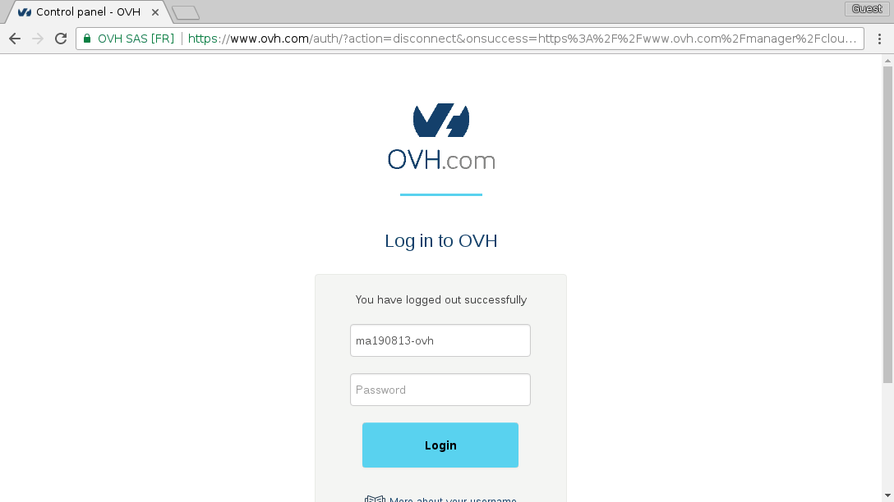
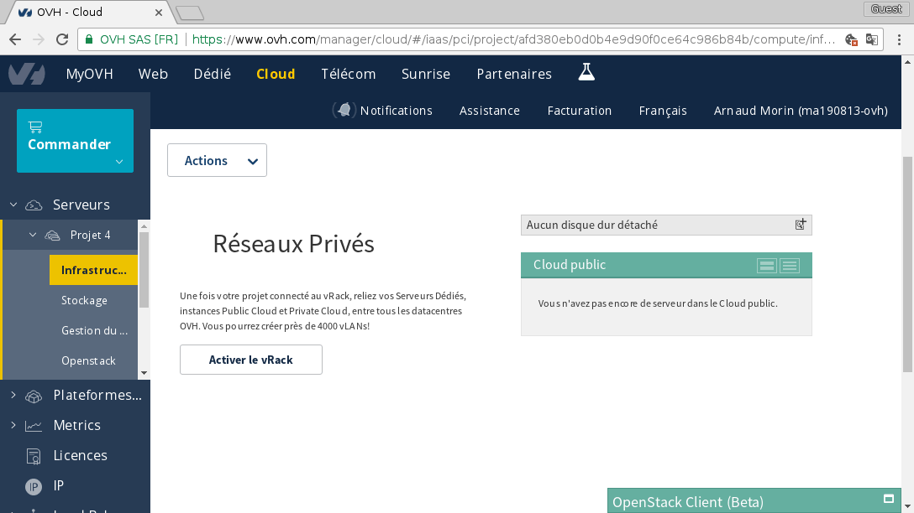
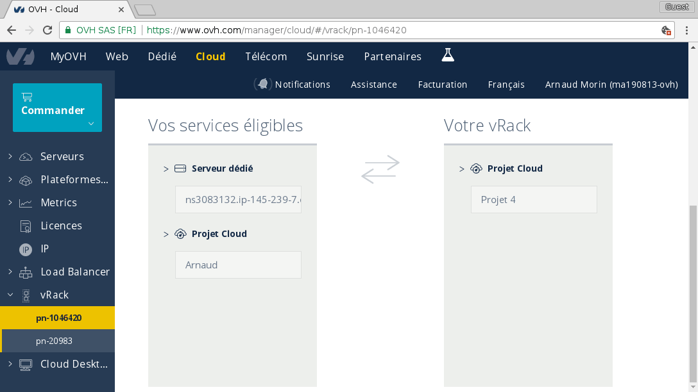
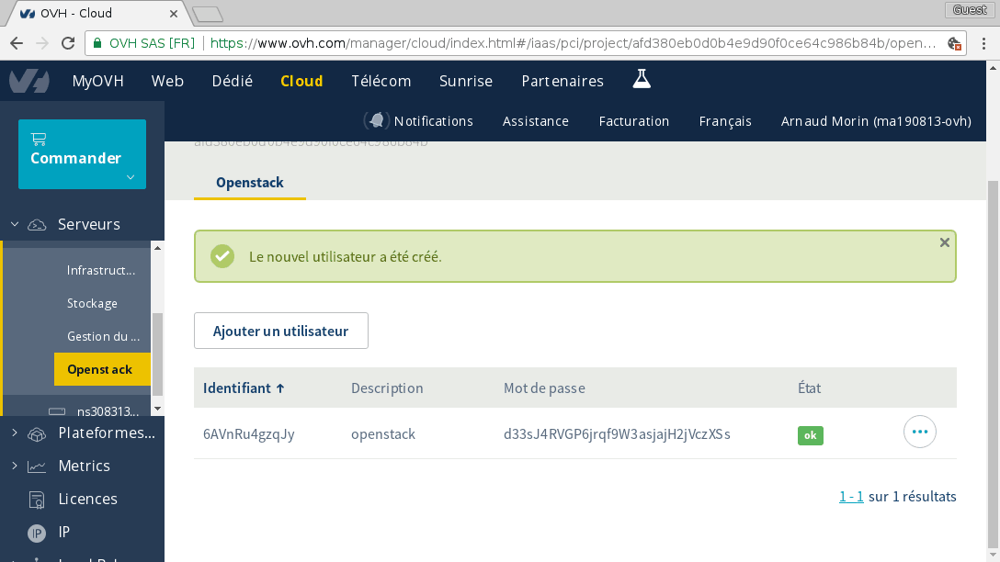
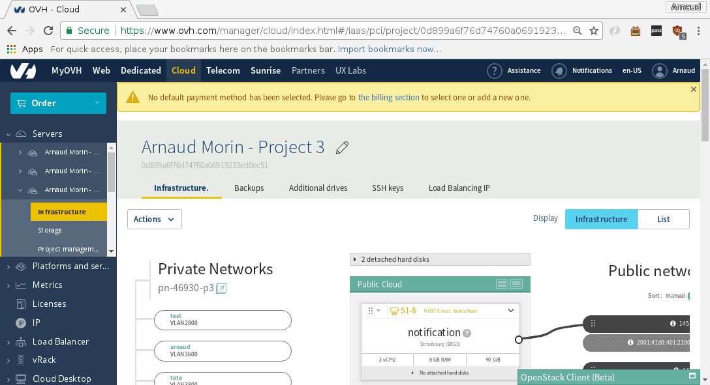

   * [Introduction](#introduction)
      * [Objective](#objective)
      * [Architecture](#architecture)
   * [Prepare your environment](#prepare-your-environment)
      * [Create your OVH account](#create-your-ovh-account)
      * [Create a cloud project](#create-a-cloud-project)
      * [Activate vRack on your cloud project](#activate-vrack-on-your-cloud-project)
      * [Link your project to this new vRack](#link-your-project-to-this-new-vrack)
      * [Create the subnets](#create-the-subnets)
      * [Create an OpenStack user](#create-an-openstack-user)
      * [Download openrc file](#download-openrc-file)
      * [Order a /28 failover IP block](#order-a-28-failover-ip-block)
   * [Bootstrap](#bootstrap)
      * [Clone this repo](#clone-this-repo)
      * [Install openstack client](#install-openstack-client)
      * [Source openrc file](#source-openrc-file)
      * [Run bootstrap script](#run-bootstrap-script)
   * [Deploy](#deploy)
      * [Connect to deployer](#connect-to-deployer)
      * [Ansible](#ansible)
         * [Configure dynamic inventory file](#configure-dynamic-inventory-file)
         * [Check that the dynamic inventory works](#check-that-the-dynamic-inventory-works)
         * [deployer](#deployer)
         * [rabbit](#rabbit)
         * [mysql](#mysql)
         * [keystone](#keystone)
         * [glance](#glance)
         * [nova](#nova)
         * [neutron](#neutron)
         * [horizon](#horizon)
         * [compute](#compute)
         * [nova](#nova-1)
         * [All in one shot](#all-in-one-shot)
   * [Configure](#configure)
      * [Keystone](#keystone-1)
         * [Populate your OpenStack with default values](#populate-your-openstack-with-default-values)
      * [Horizon](#horizon-1)
   * [Enjoy](#enjoy)


# Introduction
## Objective

Main objective is to create an small OpenStack infrastructure within an OVH public cloud infrastructure (which is also run by OpenStack by the way :p So we will create an OpenStack over OpenStack).

## Architecture
```
                       +------------------+
              ssh      |                  |
you     +----------->  |     deployer     |
                       |                  |
                       +------------------+

                           ansible (ssh)


+------------------+   +------------------+   +------------------+         +-----+
|                  |   |                  |   |                  |         |     |
|      rabbit      |   |       nova       |   |      neutron     | +-----> |     |
|                  |   |                  |   |                  |         |  v  |
+------------------+   +------------------+   +------------------+         |  R  |
                                                                           |  a  | <--------+ Failover IP
+------------------+   +------------------+   +------------------+         |  c  |            xxx.xxx.xxx.xxx/28
|                  |   |                  |   |                  |         |  k  |
|      mysql       |   |      glance      |   |      compute     | +-----> |     |
|                  |   |                  |   |                  |         |     |
+------------------+   +------------------+   +------------------+         +-----+

+------------------+   +------------------+
|                  |   |                  |
|      horizon     |   |     keystone     |
|                  |   |                  |
+------------------+   +------------------+
```

Every machine will have a public IP and be accessible from internet.

Neutron and compute will also be connected through vRack.

In this vRack we will route a failover IP block (/28 in my example) so that we can give public IPs to instances / routers.

Deployer is used to configure the others (like an admin / jumphost machine).

# Prepare your environment
To start working on this project, you must have:
 - an account on OVH
 - a cloud project
 - a vRack

## Create your OVH account
See here:
https://www.ovh.com/fr/support/new_nic.xml

## Create a cloud project



## Activate vRack on your cloud project



## Link your project to this new vRack


## Create the subnets
You must create two subnets:
 - one with a VLAN ID (you choose, don't care) named **management** and **DHCP enable**
 - one without any VLAN ID named **public** and **DHCP disabled**

Respect the names as we refer to them within the bootstrap script.

Example of creation of the management network from CLI:

```sh
$ openstack network create management
$ openstack subnet create --dhcp --gateway none --subnet-range 192.168.1.0/24 --network management 192.168.1.0/24
```

Example of creation of the public network from manager:



## Create an OpenStack user


## Download openrc file



## Order a /28 failover IP block

To do that, you can run the script data/order_ip_block.py
```sh
$ python3 order_ip_block.py
Please pay the BC 12345678 --> https://www.ovh.com/cgi-bin/order/displayOrder.cgi?orderId=12345678&orderPassword=ABCD
Done
```

Once your BC (Bon de Commande / order) is paid, you should receive a /28 in your manager. You can now move this pool of IP in your vRack by doing so:



# Bootstrap
## Clone this repo
```sh
$ git clone https://github.com/arnaudmorin/bootstrap-openstack.git
$ cd bootstrap-openstack
```

## Install openstack client
```sh
$ pip install python-openstackclient
```

## Source openrc file
```sh
$ source openrc.sh
```

## Run bootstrap script
```sh
$ ./bootstrap.sh
```

This will create 9 instances, connected to both public network (Ext-Net) and vRack (public), one for each OpenStack services (see architecture) and one deployer that you will use as jump host / ansible executor.

Wait for the instances to be ACTIVE.
You can check the status with:

```sh
$ openstack server list
```

# Deploy
## Connect to deployer
Now that your infrastructure is ready, you can start the configuration of OpenStack itself from the deployer machine.

```sh
$ ssh -i data/zob.key ubuntu@deployer_ip    # Replace deployer_ip with the real IP.
```

Now that you are inside the deployer, be root
```sh
$ sudo su -
```

## Ansible
### Configure dynamic inventory file
Ansible is using a dynamic inventory file that will ask openstack all instances that you currently have in your infrastructure.
A config file should already be configured in /etc/ansible/openstack.yml
You can check its content and update if necessary

### Check that the dynamic inventory works
```sh
$ /etc/ansible/hosts --list
```

should return something ending like:
```
...
  "ovh": [
    "horizon",
    "mysql",
    "compute-1",
    "neutron",
    "glance",
    "nova",
    "keystone",
    "rabbit",
    "deployer"
  ]
}
```

### deployer
Run ansible on deployer itself, so it can learn the different IP addresses of your infrastructure.
```sh
$ ansible-playbook /etc/ansible/playbooks/deployer.yml
```

### rabbit
Continue with rabbit
```sh
$ ansible-playbook /etc/ansible/playbooks/rabbit.yml
```

### mysql
Then mysql
```sh
$ ansible-playbook /etc/ansible/playbooks/mysql.yml
```

### keystone
Then keystone
```sh
$ ansible-playbook /etc/ansible/playbooks/keystone.yml
```

### glance
Then glance
```sh
$ ansible-playbook /etc/ansible/playbooks/glance.yml
```

### nova
Then nova
```sh
$ ansible-playbook /etc/ansible/playbooks/nova.yml
```

### neutron
Then neutron
```sh
$ ansible-playbook /etc/ansible/playbooks/neutron.yml
```

### horizon
Then horizon
```sh
$ ansible-playbook /etc/ansible/playbooks/horizon.yml
```

### compute
And finally, compute
```sh
$ ansible-playbook /etc/ansible/playbooks/compute.yml
```

### nova
Then nova again, to register the compute in nova cell
```sh
$ ansible-playbook /etc/ansible/playbooks/nova.yml
```

### All in one shot
Or if you want to perform all in one shot:
```sh
$ for s in deployer rabbit mysql keystone glance nova neutron horizon compute nova ; do ansible-playbook /etc/ansible/playbooks/$s.yml ; done
```

# Configure
## Keystone
On keystone server, you will find the openrc_admin and openrc_demo files that can be used to access your brand new OpenStack infrastructure
You will also find a helper script that contains basic functions to create images, networks, keypair, security groups, etc.

### Populate your OpenStack with default values

From your keystone node, as root:
```sh
# Source helper functions
source helper

# Following actions are done as admin
source openrc_admin
create_flavors
create_image_cirros
create_image_ubuntu
# Before running this one, update the function in helper and source it again to ajust with your network settings
create_network_public

# Following actions are done as demo
source openrc_demo
create_network_private
create_rules
create_key
create_server_public
```

## Horizon
You can also browse the dashboard by opening url like this: http://*your_horizon_ip*/horizon/

# Enjoy

